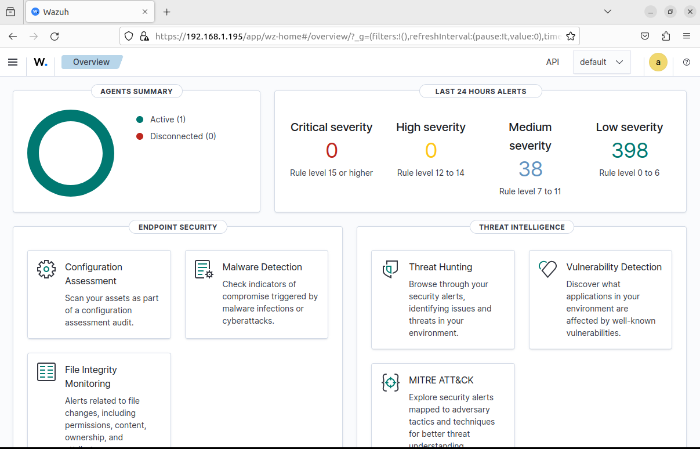
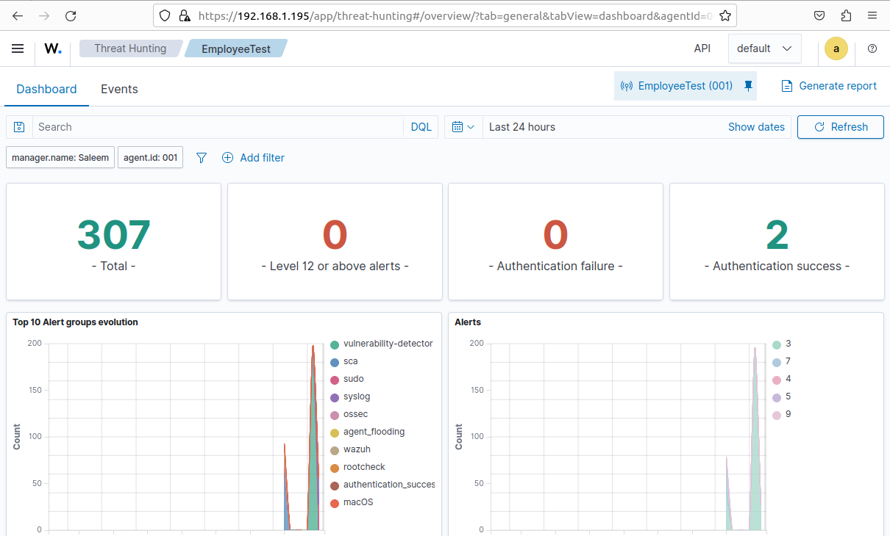
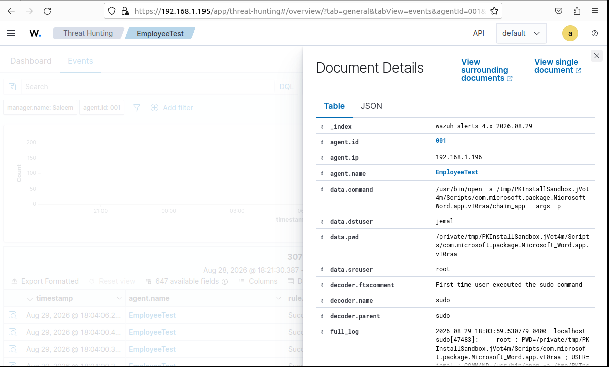
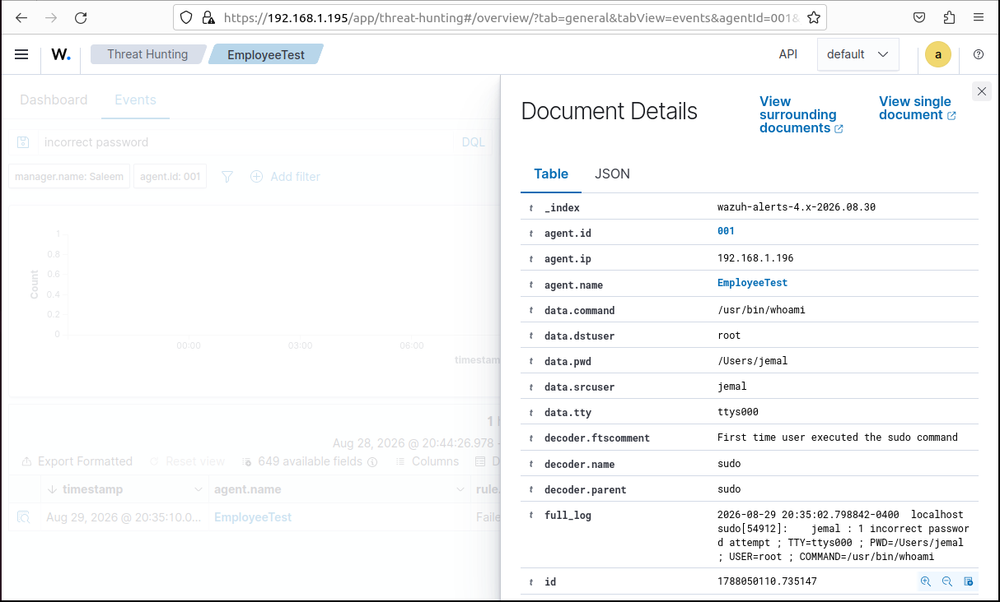
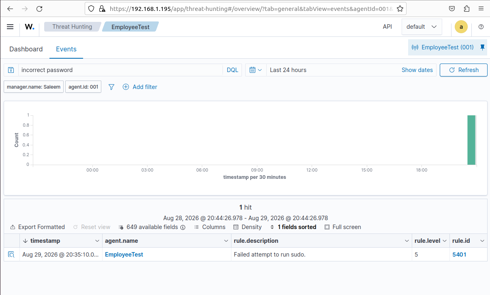
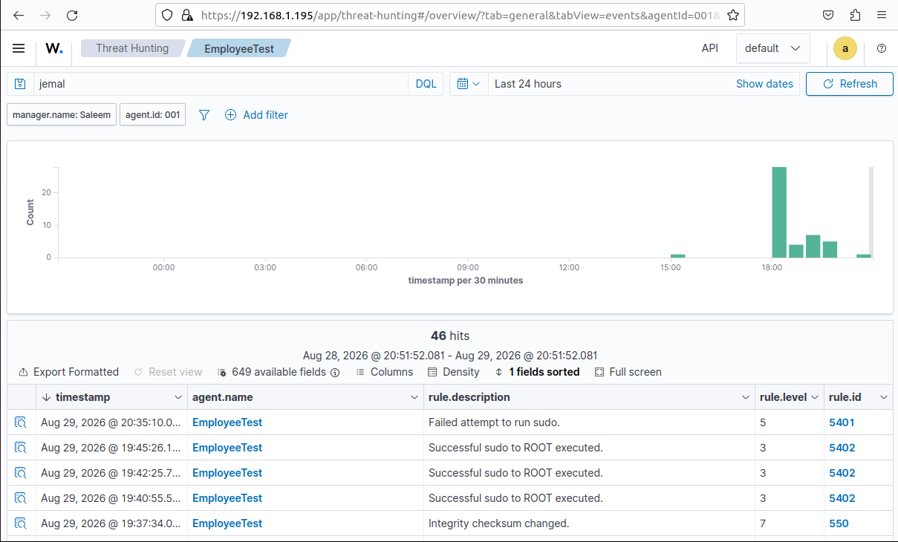

# Project – Wazuh SIEM Security Monitoring & SOC Investigation Lab

---

## Overview

This project demonstrates the deployment and hands-on use of a **Wazuh SIEM environment** to simulate real-world Tier 1 SOC monitoring and investigation workflows.

I deployed Wazuh within an Ubuntu virtual machine and connected a separate macOS endpoint named **EmployeeTest** for endpoint monitoring. After establishing communication between the endpoint and Wazuh manager, I generated controlled security activity and used Wazuh Threat Hunting to investigate the resulting events.

The primary scenarios focused on **privileged account activity, sudo command execution, failed privileged authentication, event filtering, and security-event analysis**.

Rather than simply generating alerts, I investigated the underlying event data to identify the affected endpoint, user, command, privilege context, Wazuh rule, and surrounding activity.

---

## Environment

| Tool / Technology | Purpose |
|------|---------|
| Wazuh | SIEM/XDR platform used for security monitoring and alert investigation |
| Ubuntu Linux | Hosted the Wazuh manager, indexer, and dashboard |
| VirtualBox | Virtualization platform for the Wazuh server |
| macOS | Monitored test endpoint |
| Wazuh Agent | Collected endpoint telemetry from EmployeeTest |
| Wazuh Threat Hunting | Security event searching, filtering, and investigation |
| SSH | Remote administration and connectivity testing |
| Linux/macOS CLI | Generated controlled security activity and performed administration |
| GitHub | Project documentation and evidence |

---

## Lab Architecture

The environment consisted of a dedicated Wazuh server and a separate monitored endpoint.

### Wazuh Server

- Ubuntu Linux virtual machine
- Wazuh Manager
- Wazuh Indexer
- Wazuh Dashboard
- IP during lab: `192.168.1.195`

### Monitored Endpoint

- Endpoint name: `EmployeeTest`
- macOS
- Wazuh Agent
- IP during lab: `192.168.1.196`
- Test user: `jemal`

The Wazuh agent forwarded endpoint security telemetry to the Wazuh manager, where events could be searched and investigated through the Wazuh dashboard.

---

## Wazuh SIEM Deployment & Monitoring

After deploying the Wazuh environment, I verified that the SIEM was receiving and processing endpoint telemetry.

The Wazuh Overview dashboard confirmed:

- **1 active monitored agent**
- **0 disconnected agents**
- **398 low-severity alerts**
- **38 medium-severity alerts**
- Security capabilities including Threat Hunting, Vulnerability Detection, File Integrity Monitoring, Malware Detection, and Configuration Assessment

*Wazuh Overview dashboard confirming one active monitored endpoint and hundreds of security events categorized by severity.*

---

## EmployeeTest Endpoint Monitoring

The **EmployeeTest** macOS endpoint was connected to the Wazuh environment and monitored through the Threat Hunting dashboard.

During the lab, Wazuh collected hundreds of security events associated with the endpoint.

The dashboard provided visibility into alert categories including:

- sudo activity
- syslog events
- macOS events
- authentication activity
- vulnerability detection
- security configuration assessment

*Threat Hunting dashboard for EmployeeTest showing security events generated by the monitored endpoint.*

---

# SOC Investigation Scenarios

---

## 🟠 Scenario 1 – Privileged Command Activity Investigation

**Scenario:** Security telemetry associated with privileged command execution was generated on the EmployeeTest endpoint. The event was then investigated through Wazuh to determine what occurred.

### Investigation Process

1. Identified the affected endpoint: **EmployeeTest**
2. Reviewed the endpoint IP address
3. Identified the source and destination users
4. Reviewed the command associated with the event
5. Examined the working directory
6. Identified the Wazuh decoder responsible for parsing the activity
7. Reviewed the raw event information for additional context

The event details showed fields such as:

- `agent.name: EmployeeTest`
- `agent.ip: 192.168.1.196`
- `data.dstuser: jemal`
- `data.srcuser: root`
- `decoder.name: sudo`

The event also contained the command executed during the monitored activity.

*Detailed Wazuh event investigation showing the EmployeeTest endpoint, user context, sudo activity, command information, working directory, and raw event data.*

### SOC Principle Applied

An alert should not be evaluated based only on its description. Reviewing the underlying event fields provides the context necessary to determine **who performed the activity, where it occurred, what command was executed, and what privilege level was involved**.

---

## 🔴 Scenario 2 – Failed Privileged Authentication

**Scenario:** A controlled failed authentication attempt was generated by intentionally entering an incorrect password while attempting to execute a privileged command with `sudo`.

Wazuh detected the activity and generated:

> **Failed attempt to run sudo.**

The event was categorized as:

- **Rule ID:** `5401`
- **Rule Level:** `5`
- **Endpoint:** `EmployeeTest`

I used the Threat Hunting search functionality to filter for:

`incorrect password`

This reduced the event dataset to the relevant failed authentication event.

*Threat Hunting results filtered for an incorrect-password condition, identifying a failed sudo attempt on EmployeeTest.*

### Investigation

After identifying the alert, I opened the event details to determine exactly what occurred.

The underlying event showed:

- **Agent:** EmployeeTest
- **Source user:** `jemal`
- **Destination user:** `root`
- **Command:** `/usr/bin/whoami`
- **Working directory:** `/Users/jemal`
- **Decoder:** `sudo`
- **Condition:** `1 incorrect password attempt`

*Detailed event evidence showing the source user, attempted root context, command, working directory, and incorrect-password condition.*

### SOC Principle Applied

Failed privileged authentication can indicate anything from a legitimate password mistake to attempted privilege escalation.

A SOC analyst should validate the **user, endpoint, attempted command, surrounding activity, and frequency** before determining whether escalation is necessary.

---

## 🔵 Scenario 3 – Privileged Activity Timeline & Event Correlation

**Scenario:** Rather than investigating the failed sudo event in isolation, I searched for additional activity associated with the test user to understand what occurred before and around the alert.

Searching for the user produced **46 related events**.

The timeline included:

- Failed sudo execution
- Successful sudo-to-root execution
- Additional successful sudo activity
- File integrity activity

*EmployeeTest event timeline showing successful sudo-to-root activity, a failed sudo attempt, and other endpoint security events associated with the test user.*

This demonstrated the importance of examining **surrounding events rather than treating every SIEM alert independently**.

A single failed sudo attempt may be relatively low risk. However, repeated failures, unusual commands, unexpected users, or other suspicious activity around the same timestamp could significantly increase the severity of an investigation.

### SOC Principle Applied

**Event correlation provides context.** Analysts should review activity before and after an alert to determine whether it represents an isolated event or part of a larger pattern.

---

## SOC Investigation Workflow Practiced

The scenarios were approached using a repeatable Tier 1 SOC investigation methodology:

**Alert → Identify Endpoint/User → Review Event Details → Examine Command/Activity → Review Surrounding Events → Determine Context → Document Findings**

For authentication-related activity:

**Alert → Identify User → Review Authentication Result → Examine Privileged Activity → Search Related Events → Determine Legitimacy → Escalate if Necessary → Document**

This workflow can be adapted to other SOC scenarios such as malware alerts, suspicious PowerShell activity, phishing, impossible travel, and unusual network connections.

---

## Skills Demonstrated

| Skill | How It Was Applied |
|-------|--------------------|
| SIEM Administration | Deployed and operated a functional Wazuh SIEM environment |
| Endpoint Monitoring | Connected and monitored a separate macOS endpoint through Wazuh |
| Threat Hunting | Used Wazuh Threat Hunting to search and filter endpoint security telemetry |
| Alert Triage | Identified and validated security alerts before investigating further |
| Authentication Investigation | Investigated a failed privileged authentication attempt |
| Privileged Access Monitoring | Reviewed successful and unsuccessful sudo activity |
| Event Analysis | Examined users, commands, timestamps, working directories, decoders, and raw logs |
| Event Correlation | Reviewed surrounding endpoint activity to establish investigative context |
| Linux/macOS Administration | Used command-line tools and SSH while configuring and operating the lab |
| Troubleshooting | Diagnosed configuration, service, certificate, networking, and connectivity issues during deployment |
| Documentation | Captured evidence and documented investigation findings |

---

## Key Findings

### Finding 1 – Successful Privileged Activity

Wazuh successfully detected and logged sudo activity occurring on the monitored EmployeeTest endpoint.

The events provided sufficient context to identify the associated user, privilege level, command, endpoint, and timestamp.

### Finding 2 – Failed Sudo Authentication

An intentionally generated incorrect-password attempt triggered a **Failed attempt to run sudo** event.

The event was successfully isolated using Threat Hunting and investigated through its underlying event fields.

### Finding 3 – Surrounding Activity Provided Additional Context

Searching activity associated with the test user revealed both successful and unsuccessful privileged operations.

This reinforced an important SOC concept:

> **Individual alerts should be evaluated within the context of surrounding endpoint activity whenever possible.**

---

## Challenges & Troubleshooting

Building the lab also required troubleshooting several infrastructure issues before the SIEM became fully operational.

Examples included:

- Expanding the Ubuntu VM disk to provide sufficient storage for Wazuh
- Repairing partially installed Wazuh components after an interrupted installation
- Troubleshooting Wazuh Manager and Dashboard services
- Identifying missing dashboard SSL certificate files
- Restoring required certificate files
- Validating network connectivity between the Ubuntu Wazuh server and monitored endpoint
- Testing bidirectional network communication
- Using SSH for remote endpoint administration

Troubleshooting these issues provided additional hands-on experience beyond simply following an installation guide.

---

## Lessons Learned

**Alert context matters.** An alert description provides a starting point, but fields such as the user, endpoint, command, timestamp, privilege context, and raw log provide the evidence needed to understand what actually occurred.

**A failed login is not automatically an incident.** The failed sudo scenario demonstrated why analysts need to examine frequency, surrounding activity, user behavior, and the attempted action before deciding whether something is malicious.

**Event correlation improves investigations.** Looking at activity surrounding an alert provides significantly more context than analyzing a single event independently.

**SIEM engineering and SOC analysis are connected.** Building the environment required troubleshooting services, networking, certificates, endpoint communication, and configuration issues before security telemetry could be analyzed.

**Controlled testing is valuable.** Generating known activity made it possible to understand what the corresponding telemetry looks like inside a SIEM and how an analyst would investigate it.

---

## Project Outcome

The final environment successfully provided:

- A functioning Wazuh SIEM
- An active monitored endpoint
- Centralized endpoint telemetry
- Hundreds of security events
- Privileged activity detection
- Failed authentication detection
- Searchable security events
- Detailed event investigation
- Event correlation and timeline analysis

The project provided practical experience with the same fundamental workflow used in SOC environments:

**Monitor → Detect → Investigate → Correlate → Determine Context → Document**

---

## References

- [Wazuh Documentation](https://documentation.wazuh.com/current/)
- [Wazuh Threat Hunting Documentation](https://documentation.wazuh.com/current/user-manual/wazuh-dashboard/threat-hunting.html)
- [Wazuh Rules Documentation](https://documentation.wazuh.com/current/user-manual/ruleset/rules/index.html)
- [MITRE ATT&CK](https://attack.mitre.org/)
- [NIST Cybersecurity Framework](https://www.nist.gov/cyberframework)

---

## Disclaimer

This project was conducted in a controlled home-lab environment using systems and accounts authorized for testing. Security events were intentionally generated for educational purposes to practice SIEM monitoring, alert triage, and SOC investigation techniques.
